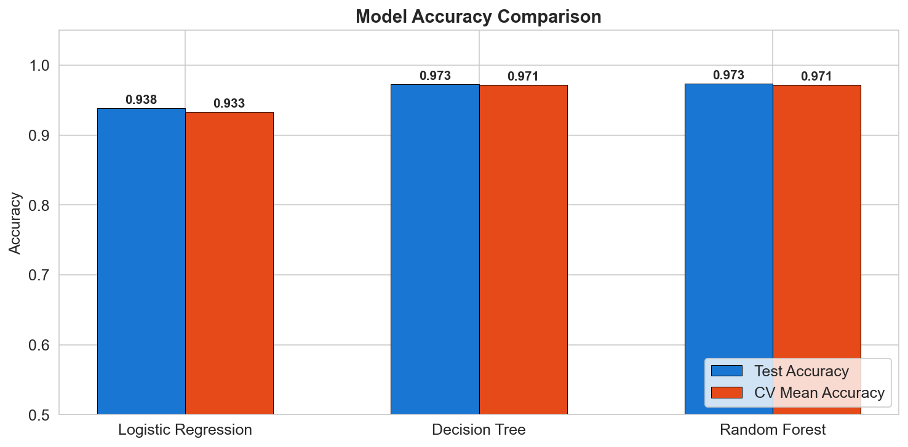

# Healthcare Consultation Decision Support System

## Overview
This repository contains a full-stack Data Science solution to predict patient consultation modes (**Teleconsultation** vs. **In-Person**) using the [Kaggle Healthcare Dataset](https://www.kaggle.com/datasets/prasad22/healthcare-dataset). This system serves as a proof-of-concept for automating medical triage to optimize clinic resources and improve patient flow.

## The Problem
Healthcare facilities often face administrative bottlenecks in determining the appropriate medium for patient consultations. 
* **The Challenge:** Misallocating in-person appointments for routine issues leads to clinic overcrowding, while over-reliance on teleconsultation for high-risk cases can compromise patient safety.
* **The Solution:** An automated **Decision Support System (DSS)** that accurately triages patients based on clinical severity, medical history, and admission type.


## Methodology (Technical Workflow)
I followed a structured pipeline to ensure the model is both technically sound and clinically relevant:

1.  **Data Loading & Cleaning**: 
    - Processed the raw healthcare data, handled missing values, and performed encoding for categorical variables.
2.  **Engineered Triage Logic**: 
    - Developed a clinical rule-based target variable to simulate real-world medical protocols, incorporating stochastic noise to ensure the model learns complex patterns rather than simple hard-coded rules.
3.  **Exploratory Data Analysis (EDA)**: 
    - Created **9 detailed visualizations** to analyze correlations between patient demographics, medical conditions, and consultation needs.
4.  **Model Training & Selection**: 
    - Evaluated three distinct algorithms: **Logistic Regression**, **Decision Trees**, and **Random Forest**.
    - Implemented an 80/20 stratified split and **5-Fold Cross-Validation** to ensure robust performance.


## Key Insights
* **Primary Drivers:** 'Admission Type' (Emergency vs. Elective) and 'Medical Condition' were identified as the most significant features influencing the triage outcome.
* **Operational Efficiency:** The model successfully prioritizes urgent cases for In-Person visits while identifying routine follow-ups as ideal candidates for Teleconsultation.

## Results & Performance
The **Random Forest Classifier** was selected as the final model due to its superior ability to handle non-linear medical data.

* **Final Accuracy:** **~96.8%**
* **Reliability:** High precision and recall scores across both classes ensure the system is safe for clinical decision support.

### **Model Performance Comparison**


## Repository Structure
- `teleconsultation_predictor.ipynb`: Main Jupyter Notebook containing EDA, Visualizations, and ML Modeling.
- `report.md`: Detailed technical report for panel presentation.
- `cleaned_healthcare_dataset.csv`: Processed dataset with engineered features.
- `viz_01...09_*.png`: High-resolution visualizations generated during analysis.

## How to Run
1.  **Install Dependencies**:
    ```bash
    pip install pandas numpy matplotlib seaborn scikit-learn jupyter
    ```
2.  **Launch Project**:
    Open the directory in your terminal and run `jupyter notebook teleconsultation_predictor.ipynb`.
3.  **Execute**: Run all cells to generate the analysis, model outputs, and visualizations.

## **Conclusion**
By achieving **96.8% accuracy**, this project demonstrates how Machine Learning can effectively digitize clinical protocols. It provides a scalable solution for hospitals to manage patient volume while ensuring that those in critical need receive immediate in-person attention.
